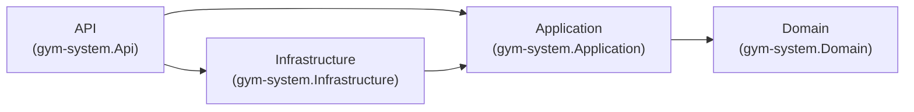

# gym-system-backend Architecture Guide

## 1) 分層與依賴方向

本專案採用分層架構，依賴方向只能往內：

- `Api -> Application -> Domain`
- `Infrastructure -> Application`

禁止反向依賴，例如 `Application -> Infrastructure` 或 `Domain -> Api`。

## 2) 各層責任

### API 層
- 對外 HTTP 入口（Controller）。
- 驗證/組裝 request，呼叫 Application UseCase。
- 將 Application 結果轉為 API response contract。
- 不放業務規則與資料存取細節。

### Application 層
- UseCase、Command/Query Handler、Port 介面。
- 協調業務流程，依賴 Domain 與抽象介面。
- 不直接依賴 Dapper/EF/SQL/Controller/HttpContext。

### Domain 層
- 核心業務模型與規則。
- 不依賴 `Application`、`Infrastructure`、`Api`。
- 不含框架或資料庫技術細節。

### Infrastructure 層
- 實作 Application 定義的介面（Repository/QueryService 等）。
- 處理 SQL、Dapper、EF、外部服務整合。
- 不承載核心業務決策。

## 3) DTO 與模型邊界

- `Api.Contracts.*` 僅限 API 層使用。
- `Application` 的 `Command/Result` 供 UseCase 內部與跨層協作。
- `Domain` Entity/ValueObject 不直接外露為 API response。

### Query Result 命名規範（目前決策）

本專案允許 Query Read Model 使用資料庫欄位命名（例如 `usr_id`），以降低 `AS` 與 mapping 成本。

適用前提：
- 僅用於 Query（讀取模型）。
- 不混入 Domain 業務規則。
- 團隊接受「命名耦合 DB」的維護成本。

## 4) 不可接受的跨層案例

1. `Application` 直接引用 `Infrastructure` 實作或直接寫 SQL。
2. `Domain` 引用 `Application` / `Infrastructure` / `Api` namespace。
3. UseCase 直接使用 `Api.Contracts` request/response 型別。
4. Controller 直接操作 `DbContext`/Dapper，繞過 Application Handler。
5. 任何循環依賴（circular dependency）。

## 5) PR 檢查清單

每個 PR 至少檢查以下項目：

1. 是否新增反向依賴（尤其 `Application -> Infrastructure`）？
2. Controller 是否只負責協調與資料轉換，不含業務邏輯？
3. Domain 是否引入框架或資料庫技術型別？
4. Query Result 是否被誤用到 Command 或 Domain 規則？
5. 是否引入循環依賴？

## 6) Instructor Query（現況範例）

目前流程屬於可接受模式：

- `InstructorController (Api)` 呼叫 `GetInstructorsListHandler (Application)`
- Handler 依賴 `IInstructorQueryService (Application interface)`
- `DapperGetInstructorsQueryService (Infrastructure)` 實作該介面並查 DB
- 回傳 `InstructorResult (Application Query model)` 給 API 做 response mapping
